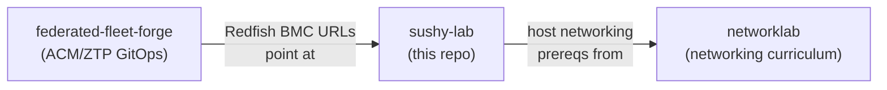

# sushy-lab

Libvirt-based bare-metal lab infrastructure: host networking, Sushy Redfish
emulation, and VM lifecycle. Provides the BMC layer that
[federated-fleet-forge](https://github.com/federated-fleet-forge) deploys
OpenShift clusters onto.

## How it fits together

## Build order

Set up the lab in this order:

| Step | Directory | What it does |
|------|-----------|-------------|
| 1 | [`host-setup/`](host-setup/) | Configure host networking (bridge, VLANs, dnsmasq) and libvirt storage pools |
| 2 | [`sushy/`](sushy/) | Install the Sushy Redfish emulator as a systemd service |
| 3 | [`vms/`](vms/) | Create libvirt VMs that Sushy exposes as Redfish systems |
| 4 | *Verify* | `curl http://localhost:8000/redfish/v1/Systems/ \| jq .` |

Once VMs are running and Redfish endpoints respond, the infrastructure is
ready for OpenShift deployment via ACM/MCE.

## Prerequisites

- **Fedora** or **RHEL** host with hardware virtualisation enabled
- **libvirt** and **qemu-kvm** installed
- **Podman** (for the Sushy container)
- A boot ISO in `/var/lib/libvirt/boot/` (e.g. Fedora netinst or RHCOS)

## Default IP scheme

| Network | Subnet | Purpose |
|---------|--------|---------|
| `br0` | From DHCP on physical NIC | Primary bridge for VM traffic |
| `routednet` | `192.168.192.0/24` | Routed libvirt network with DHCP reservations |
| Sushy host | `192.168.188.50:8000` | Redfish emulator endpoint |

Edit these in `host-setup/routednet.xml` and the dnsmasq config files to
match your environment. Scripts accept `REDFISH_HOST` and `REDFISH_PORT`
environment variables.

## CRC utilities

The [`crc/`](crc/) directory contains tools for managing multiple CRC
(OpenShift Local) profiles and DNS resolution. CRC can serve as the ACM
hub cluster for this lab.

## Related repositories

- **[networklab](https://github.com/ngner/networklab)** -- Deep-dive
  Linux networking curriculum (bridge, macvlan, ipvlan, OVS, OVN) for
  understanding the constructs used in host-setup.
- **[federated-fleet-forge](https://github.com/federated-fleet-forge)** --
  ACM/ZTP GitOps reference architecture for deploying OpenShift to these
  VMs. The
  [libvirt-lab site config](https://github.com/federated-fleet-forge/example-ocp-ztp)
  targets the Sushy Redfish endpoints created by this repo.
- **[Red Hat ACM on-prem CLI cluster creation](https://docs.redhat.com/en/documentation/red_hat_advanced_cluster_management_for_kubernetes/2.14/html-single/clusters/index#on-prem-creating-your-cluster-with-the-cli)** --
  Official documentation for the manual (non-ZTP) ACM deployment flow.

## License

Apache-2.0. See [LICENSE](LICENSE).
